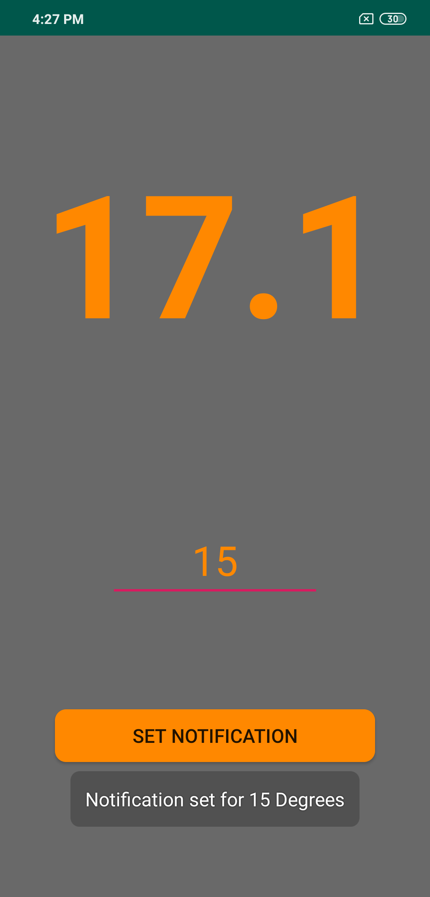

# TeaTime
Wireless temperature sensor. Android app which interacts via bluetooth with Bluno Beetle. Developed with intent to place sensor in a cup of Tea and receive a notification to my phone when the tea is at my desired temperature.

## Device
Bluno Beetle, powered by two cr2032 in series to make 6V. Temperature read using a ds18b20 sensor.

## Start Screen
Once the device has been switched on you can press the connect button, the app will then scan the area for the device and connect if found.

## Temperature

Once connected the app will display the temperature read from the device, updating every second.

## notifications

From this screen you can input a temperature you want the phone to send a notification when it reaches this temperature.

